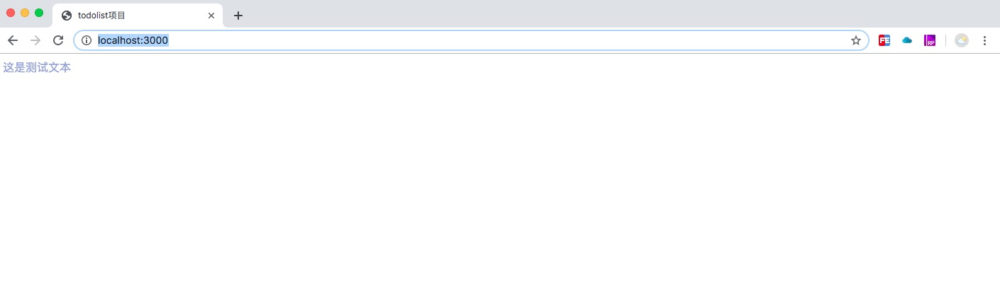

# webpack配置

## 操作系统和开发工具版本

| 涉及工具        |      工具版本      |
| --------------| :----------------: |
| 操作系统        |      Mac Pro       |
| Node          |       12.1.0       |
| Npm           |       6.9.0        |
| webpack       |       4.31.0       |
| webpack-cli   |       3.1.1        |
| vue           |       3.7.0        |

## 项目初始化

运行以下命令来创建一个新项目：

```
vue init
```
然后一路回车，之后生成一个package.json为文件

接着安装一些相关的依赖文件
```
cnpm install vue --save
cnpm install vue-loader webpack --save-dev
```
## 编译.vue文件

webpack4 默认的打包入口文件为`./src`下的`index.js`或者`main.js`文件，因此我们新建一个`src`目录，
在该目录下新建一个`index.js`文件作为入口文件，接着再创建一个`app.vue`文件作为我们要打包的文件。

`index.js`文件代码

```js{4}
import Vue from 'vue';
import App from './app.vue';

const root = document.createElement('div');  //创建div节点
document.body.appendChild(root);            //将div节点添加到body下

new Vue({
  render:(h)=>h(App)
}).$mount(root);  //将vue实例挂在到root节点上
```
我们为`app.vue`文件创建一些简单的内容
```js{4}
<template >
    <div class="text">{{text}}</div>
</template>
<script>
  export default {
        data(){
          return{
            text:"这是测试文本"
          }
        }
  }
</script>
<style scoped>
    .text{
      color:rgb(148, 163, 218);
    }
</style>
```
接下来我们来配置webpack，我们在项目目录下新建一个webpack.config.js文件，直接上代码，再加注释
```js{4}
const path = require('path');   //node内置的文件模块，方便处理各种路径问题
const { VueLoaderPlugin } = require('vue-loader');  //vue-loader升级到15.0+版本之后必须是使用该插件，不然在编译的时候一直报错

module.exports = {
  mode:"development",
  entry:path.join(__dirname,'src/index.js'),
  output:{                                            //声明出口文件
      filename: 'bundle.js',                          //将挂载的App全部打包成一个bundle.js,在浏览器中可以直接运行的代码
      path: path.join(__dirname,'dist')               //bundle.js保存的位置
  },
  module:{
    rules:[
      //编译所有的.vue文件
      {
        test:/.vue$/,
        loader:'vue-loader'
      }
    ]
  },
  plugins:
    [
        new VueLoaderPlugin(),  //vue-loader升级到15.0+版本要使用该插件
    ],
};
```
::: warning
  1、webpack4版本下，对应的webpack-cli也要升级，不然一直会报错
  ```
  /Users/xiaoqingqing/Works/node_modules/_webpack-cli@2.1.5@webpack-cli/bin/config-yargs.js:89
				describe: optionsSchema.definitions.output.properties.path.description,
  ```
  解决办法:
  `npm i webpack-cli@3.1.1 -D`

  2、就是在使用vue-loader15.0+版本时候，编译会报如下的错误
  `` `
  vue-loader was used without the corresponding plugin. Make sure to include VueLoaderPlugin in your webpack config.
   @ ./src/index.js 3:0-28 9:16-19
  ```
  解决办法:如上面webpack.config.js所示，使用VueLoaderPlugin这个插件
:::

## 编译es6/7/8代码

安装依赖

`npm intsall --save-dev babel-core babel-loader@7`

修改webpack.config.js


```js{4}
module.exports = {

  //...

  module:{
    rules:[
      // 编译es6/7/8代码
      {
        test:/\.js?$/,
        loader:"babel-loader",
        include:path.resolve(__dirname,"src"),// 使用 include 字段仅将 loader 模块应用在实际需要用其转换的位置中
        exclude:/node_modules/,   // 忽略node_modules里的js文件
      }
    ]
  },

  //...

};
```

## 处理.css文件

安装相关的依赖

`npm install --save-dev css-loader style-loader `

配置webpack.config.js文件

```js{4}
module.exports = {

  //...

  module:{
    rules:[
      // 编译css
      {
        test:/\.css$/,
        use:[
          'style-loader',    //将css插入到html中，js代码的形式
          'css-loader',     //将css文件里的css代码读取出来
        ]
      }
    ]
  },

  //...

};
```
接着我们创建一个`style.css`的css文件,并写上如下代码来测试css文件是否被打包处理
```js{4}
body{
  background-color: rgb(188, 233, 213);
}
```
在`index.js`这个文件下引用该文件，最终打包出来的`bundle.js`的代码里可以看到我们写入的这些样式，代码如下

`\"body{\\n  background-color: rgb(188, 233, 213);\\n}\\n\"`

## 编译.less文件
安装相关的依赖

`npm install --save-dev less-loader`

配置webpack.config.js文件

```js{4}
module.exports = {

  //...

  module:{
    rules:[
      // 编译less
      {
        test: /\.less$/,
        use:[
          {
            loader: "style-loader" // creates style nodes from JS strings
          },
          {
            loader: "css-loader" // translates CSS into CommonJS
          },
          {
            loader: "less-loader" // compiles Less to CSS
          },
        ]
      },
    ]
  },
};
```
同样的，我们新建一个`style.less`文件，在`index.js`这个文件下引用该文件，在然后写上一些less语法的测试代码

`index.js`

`import "./style.less";  //引用less文件`

`style.less`

```js{4}
@bgcolor:"blue";
body{
  background-color: @bgcolor;
}
```
编译结果如下

`\"body {\\n  background-color: \\\"blue\\\";\\n}\\n\"`

## css属性加浏览器前缀

安装依赖

`npm install --save-dev postcss-loader autoprefixer`

在根目录下创建一个postcss.config.js文件，编写一些相关的配置
```js{4}
const autoprefixer = require('autoprefixer');
//PostCss会对CSS代码进行优化,主要是解决不同浏览器识别码的问题,具体作用自行查阅
module.exports = {
    plugins: [
        autoprefixer()      //优化的过程通过一系列的组件进行优化,此次采用的是autoprefixer
    ]
};
```
接着我们修改下webpack.config.js里的配置
```js{4}
module.exports = {

  //...

  module:{
    rules:[
      // 编译less
      {
        test: /\.less$/,
        use:[
          {
            loader: "style-loader" // creates style nodes from JS strings
          },
          {
            loader: "css-loader" // translates CSS into CommonJS
          },
          {
            loader: 'postcss-loader',
              options: {
                  sourceMap: true,  //复用less-loader生成的sourceMap,加快打包的速度
              }
            },
          {
            loader: "less-loader" // compiles Less to CSS
          },
        ]
      },

    ]
  },
};
```

## 处理图片文件

安装依赖

`npm install --save-dev url-loader file-loader`

这些我们再修改下webpack.config.js里的配置

```js{4}
module.exports = {

  //...

  module:{
    rules:[
      //编译图片资源
      {
        test:/\.(gif|jpg|jpeg|png|svg)$/,
        use:[
          {
            loader:'url-loader',   //url-loader实际上依赖于file-loader,file-loader处理完文件可以保存为一个文件供处理
            options:{
              limit:1024,         //url-loader的好处是可以加一个限制的大小,对于小图片,在范围内可直接将图片转换成base64码直接存放在js中,以减少http请求.
              name: '[name].[ext]'        //输出文件的名字,[name] 文件原名,[ext]文件扩展名.
            }
          }
        ]
      }
    ]
  },
};
```
配置里的的options配置项可以根据项目需要自行配置，比如`limit`是设置将不超过多少kb的图片转为base64文件

接下来，我们测试下，我们在`index.js`里引用两张图片，代码如下

```
import "./assets/ShareImg.jpg";   //引用一张大图
import "./assets/lazy.png";  //引用一张小图
```
打包结果：大的图片被打包到`dist`目录下，而小的图片被处理成base64的文件格式,在bundle.js里可以看到打包之后生成的代码，
可以看到`sourceURL=webpack:///./src/assets/lazy.png?");`这段代码

```
eval("module.exports = \"data:image/png;base64,iVBORw0KGgoAAAANSUhEUgAAAAEAAAABCAMAAAAoyzS7AAAAA1BMVEVHcEyC+tLSAAAAAXRSTlMAQObYZgAAAA1JREFUeNoBAgD9/wAAAAIAAVMrnDAAAAAASUVORK5CYII=\"\n\n//# sourceURL=webpack:///./src/assets/lazy.png?");
```

我们再来测试下在css里通过background-image的方式引用图片，是如何打包处理的吧，
```js{4}
//style.less
@bgcolor:"blue";
body{
  background-color: @bgcolor;
  background-image: url(./assets/ShareImg.jpg);
}
```
经过测试，得到的结果也是一样的，大的图片被打包到`dist`目录下，而小的图片被处理成base64的文件格式。

## 配置webpack-dev-serve和生成html页面

安装依赖
```
npm install --save-dev webpack-dev-server  html-webpack-plugin
```

修改package.json的配置，增加一个`dev`的命令
```
"scripts": {
  "build": "webpack --config webpack.config.js",
  "dev": "webpack-dev-server --config webpack.config.js"
},
```
然后我们再稍微修改下webpack.config.js里的配置,配置devServer选项，使用`html-webpack-plugin`这个插件，
这样我们才能生成一个html将我们的内容呈现在网页上。

```js{4}
const HtmlWebpackPlugin = require('html-webpack-plugin')       //引入html-webpack-plugin

module.exports = {

  //...

  devServer: {
    hot: true,  //是否开启热更新
    port:3000,
    contentBase:"./dist",
    inline:true
  },
  plugins: [
    new HtmlWebpackPlugin({
      title:"todolist项目",  //网站标题
      filename: "index.html",
      // 如果配置了这个 则会使用我们本地的index.html
      // template: 'src/assets/index.html'
    }),
  ]
};
```
接着运行命令`npm run dev` ，访问`http://localhost:3000/`就可以看到之前编写的相关的效果了

这样一个简单的web服务就搭建好了，接下来我们再实现一些其他的功能。

## 代码的热加载

热加载的基本原理，构建 bundle 的时候，加入一段 HMR runtime 的 js代码 和一段和服务沟通的 js代码。
文件修改会触发 webpack 重新构建，服务器通过向浏览器发送更新消息，
浏览器通过 jsonp 拉取更新的模块文件，jsonp 回调触发模块热替换逻辑，
从而实现每次修改某个 js 文件后，页面局部更新。在上面的配置中，`devServer`下有个`hot`属性，
当设置为true时，才可以开启热加载功能。

同时，代码热加载需要使用webpack的两个自带的插件，因此我们得先引入webpack这个库，然后使用相关的插件
```js{4}
const webpack = require("webpack");
module.exports = {
  //...
  plugins: [
    new webpack.HotModuleReplacementPlugin(),
    new webpack.NoEmitOnErrorsPlugin()
  ]
};
```

## css单独分离打包
我们运行`npm run build`命令之后，发现在dist目录下，所有的css代码被打包到js文件里了，
显然这不是我们在生产环境所需要的，因此我们需要将css代码单独提取出来，我们可以使用
mini-css-extract-plugin这个插件来进行处理，我们来安装这个插件

`npm install mini-css-extract-plugin --save-dev`

修改webpack.config.js代码

```js{4}
const MiniCssExtractPlugin = require('mini-css-extract-plugin');

module.exports = {

  ...

  module:{
    rules:[
      {
      // 编译.less文件
      test: /\.less$/,
      use:[
        MiniCssExtractPlugin.loader,
        {
          loader: "css-loader" // translates CSS into CommonJS
        },
        {
          loader: 'postcss-loader',
            options: {
                sourceMap: true,            //复用less-loader生成的sourceMap,加快打包的速度
            }
        },
        {
          loader: "less-loader" // compiles Less to CSS
        }
      }
    ]
  },
  plugins: [

    ...

    new MiniCssExtractPlugin({
        filename: 'index.[contenthash:8].css'
    })
  ]
};
```
再次执行`npm run build`的时候，在`dist`目录下就会生成带有hash值的css文件了

现在webpack的配置已经可以实现很多功能了，但是webpack的功能还有很多，十分的强大，
比如生产环境和开发环境的设置和区分、公共代码的抽离、代码浏览器缓存等等，这些我会在接下来的文章中继续完善和优化。
