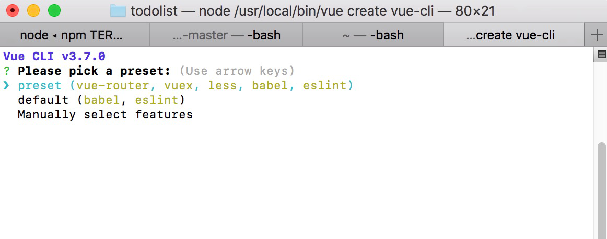
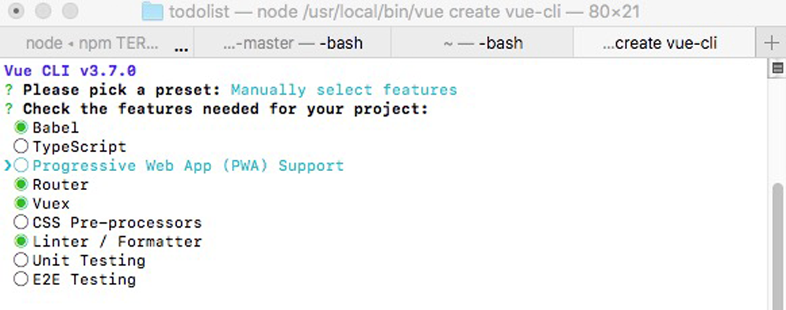
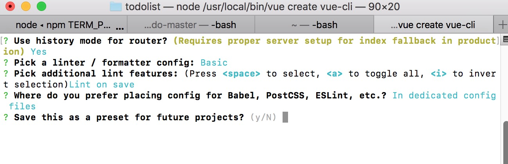

在控制台，可以看到一些可以选择的命令，然后根据自己的习惯和项目需求，进行选择配置，然后一步步的执行下去，

如果之前创建项目的时候，有保存preset,则会多出一个perset的选项（直接使用之前的配置项进行创建项目）


这里我们不选择之前的配置，重新进行配置


接下来就是一路回车就可以了，或者可以根据实际情况自行选择配置，

最后有一个是否保存配置的选项（可以方便下次项目构建的时候使用）,我这里选择的是否，如果选择是的话，
将会存在用户的 home 目录下一个名为 .vuerc 的 JSON 文件里


这个配置选完之后，就开始构建项目了，等构建完成之后，cd到对应目录执行相关命令就行。
```
$ cd vue-cli
$ npm run serve
```
## 项目目录结构

```
vue-cli
└───public
│   │   favicon.ico
│   |   index.html
└───src
│   │   App.vue
│   |   main.js
│   │   router.vue
│   |   store.js
│   │
|   └───assets
|   |    |   logo.png
│   |    |
|   └───components
│   |    |   HelloWorld.vue
│   |    |
|   └───views
|   |    |   About.vue
|   |    |   Home.vue
|   |
└───.browserslistrc
└───.eslintrc.js
└───.gitignore
└───babel.config.js
└───package.json
└───package-lock.json
└───postcss.config.js
└───README.md
```
